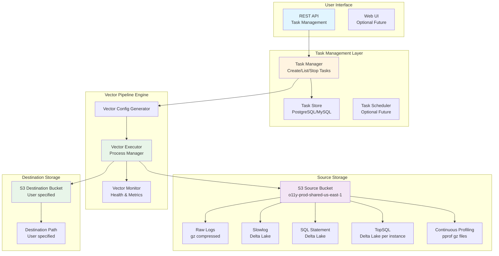
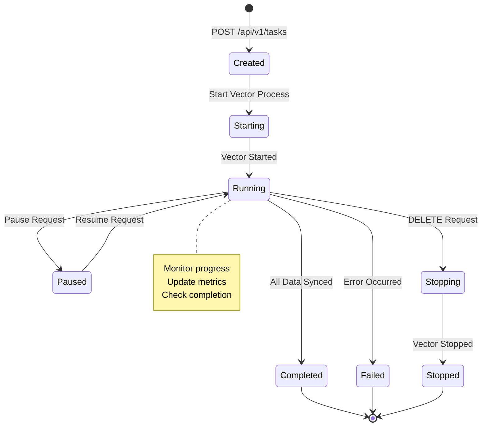
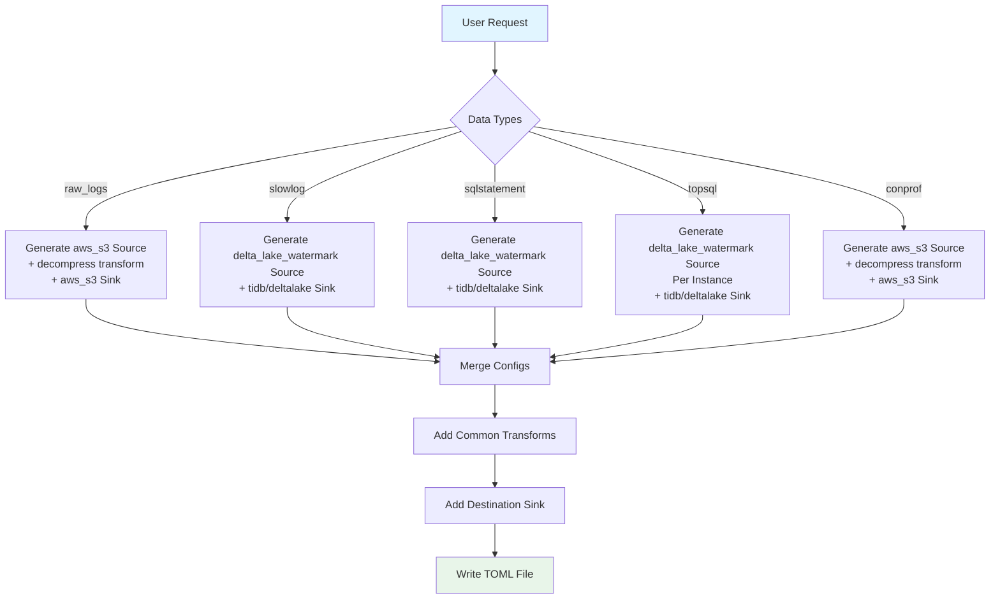
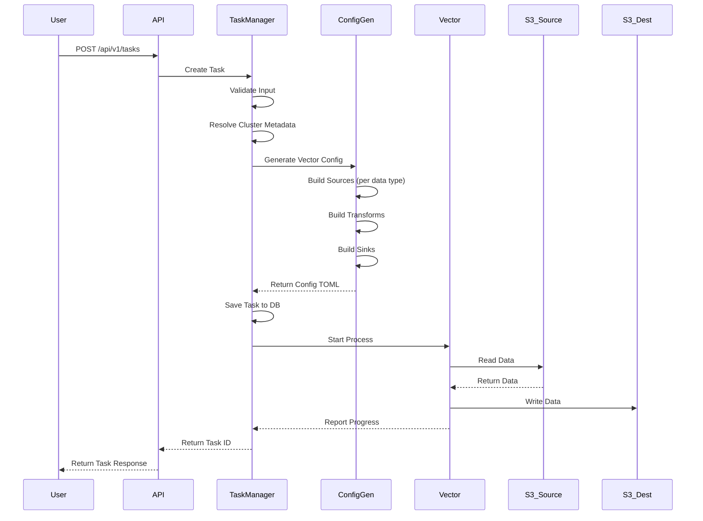
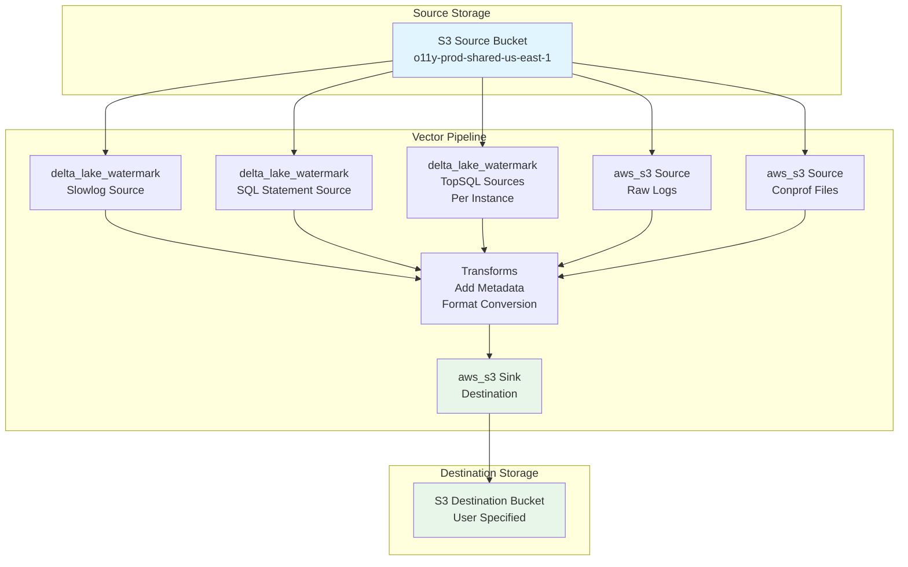
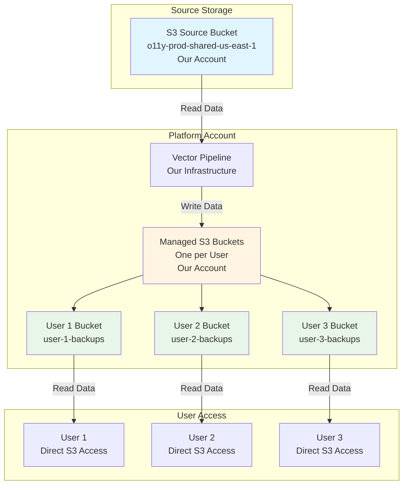
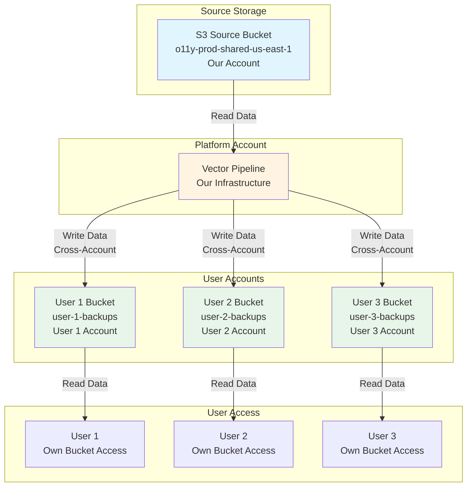

# TiDB Observability Data Sync Platform - Product Concept

## Overview

This document describes the product concept for a unified observability data synchronization platform that enables users to sync TiDB cluster observability data from source storage to destination storage through a simple API interface.

## Product Vision

**Enable users to easily synchronize TiDB cluster observability data (logs, metrics, slowlog, SQL statements, TopSQL, continuous profiling) from source storage to any destination through a unified API, with automatic task management, monitoring, and fault recovery.**

## Architecture Overview



## Phase 1: Core Functionality

### 1.1 Requirements

**User Input:**
- **Cluster ID**: TiDB cluster identifier
- **Data Types**: Multiple selection from:
  - `raw_logs`: Raw application logs (gz compressed)
  - `slowlog`: Slow query logs (Delta Lake format)
  - `sqlstatement`: SQL statement history (Delta Lake format)
  - `topsql`: TopSQL performance data (Delta Lake format, per instance)
  - `conprof`: Continuous profiling data (pprof gz files)
- **Time Range**: Start time and end time (ISO 8601 format)
- **Destination**: 
  - S3 bucket name
  - S3 prefix/path
  - AWS region (optional, defaults to source region)

**System Output:**
- Vector task configuration
- Task execution
- Task status monitoring
- Task completion notification

### 1.2 Data Source Paths

#### Raw Logs
```
s3://o11y-prod-shared-us-east-1/diagnosis/data/{cluster_id}/merged-logs/{YYYYMMDDHH}/tidb/{instance}.log
```

**Example:**
```
https://o11y-prod-shared-us-east-1.s3.us-east-1.amazonaws.com/diagnosis/data/10324983984131567830/merged-logs/2026010804/tidb/db-2006140048495349760-21a57c17-tidb-0.log
```

**Characteristics:**
- Gzip compressed log files
- Organized by timestamp (hourly)
- One file per TiDB instance per hour
- Format: Plain text or structured logs

#### Slowlog (Delta Lake)
```
s3://o11y-prod-shared-us-east-1/deltalake/{org_id}/{cluster_id}/slowlogs/
```

**Example:**
```
https://o11y-prod-shared-us-east-1.s3.us-east-1.amazonaws.com/deltalake/1372813089209061633/019aedbc-0a97-7d01-b94e-c6d0d4340c2c/slowlogs/_delta_log/_last_checkpoint
```

**Characteristics:**
- Delta Lake table format
- Single table for entire cluster
- Partitioned by time
- Schema: time, db, user, host, query_time, result_rows, prev_stmt, digest, etc.

#### SQL Statement (Delta Lake)
```
s3://o11y-prod-shared-us-east-1/deltalake/{org_id}/{cluster_id}/sqlstatement/
```

**Example:**
```
https://o11y-prod-shared-us-east-1.s3.us-east-1.amazonaws.com/deltalake/1372813089209061633/019aedbc-0a97-7d01-b94e-c6d0d4340c2c/sqlstatement/_delta_log/_last_checkpoint
```

**Characteristics:**
- Delta Lake table format
- Single table for entire cluster
- Contains SQL statement history
- Schema: time, sql_text, digest, execution_count, etc.

#### TopSQL (Delta Lake, Per Instance)
```
s3://o11y-prod-shared-us-east-1/deltalake/org={org_id}/cluster={cluster_id}/type=topsql_{component}/instance={instance}/
```

**Example:**
```
https://o11y-prod-shared-us-east-1.s3.us-east-1.amazonaws.com/deltalake/org=1372813089209061633/cluster=10324983984131567830/type=topsql_tidb/instance=db.tidb-0/_delta_log/_last_checkpoint
```

**Characteristics:**
- Delta Lake table format
- **One table per instance** (TiDB, TiKV, PD, etc.)
- Partitioned by org, cluster, type, instance
- Schema: time, sql_digest, plan_digest, cpu_time, etc.

#### Continuous Profiling (pprof gz files)
```
s3://o11y-prod-shared-us-east-1/{org_id}/{cluster_id}/{instance_id}/{cluster_id}/profiles/{timestamp}-{component}-{type}-{instance}.log.gz
```

**Example:**
```
https://o11y-prod-shared-us-east-1.s3.us-east-1.amazonaws.com/0/1372813089209061633/1372813089454544954/10324983984131567830/profiles/1767830400-pd-cpu-ZGItcGQtMC5kYi1wZC1wZWVyLnRpZGIxMDMyNDk4Mzk4NDEzMTU2NzgzMC5zdmM6MjM3OQ.log.gz
```

**Characteristics:**
- Gzip compressed pprof files
- One file per profile snapshot
- Organized by org, cluster, instance
- Format: pprof binary format (compressed)

### 1.3 System Components

#### 1.3.1 REST API Server

**Technology**: Python Flask (existing `demo/app.py` as reference)

**Endpoints:**

```http
POST /api/v1/tasks
Content-Type: application/json

{
  "cluster_id": "10324983984131567830",
  "org_id": "1372813089209061633",  # Optional, can be derived from cluster
  "data_types": ["slowlog", "sqlstatement", "topsql"],
  "time_range": {
    "start": "2026-01-08T00:00:00Z",
    "end": "2026-01-08T23:59:59Z"
  },
  "destination": {
    "bucket": "my-backup-bucket",
    "prefix": "backups/cluster-10324983984131567830/2026-01-08",
    "region": "us-west-2"
  },
  "options": {
    "batch_size": 10000,
    "poll_interval_secs": 30,
    "acknowledgements": true
  }
}
```

**Response:**
```json
{
  "task_id": "task-abc123",
  "status": "created",
  "created_at": "2026-01-08T10:00:00Z",
  "vector_config_path": "/tmp/vector-task/task-abc123/config.toml",
  "vector_pid": 12345
}
```

```http
GET /api/v1/tasks/{task_id}
```

**Response:**
```json
{
  "task_id": "task-abc123",
  "status": "running",
  "created_at": "2026-01-08T10:00:00Z",
  "updated_at": "2026-01-08T10:05:00Z",
  "progress": {
    "slowlog": {
      "status": "completed",
      "rows_processed": 150000,
      "watermark": "2026-01-08T23:59:59Z"
    },
    "sqlstatement": {
      "status": "running",
      "rows_processed": 75000,
      "watermark": "2026-01-08T12:00:00Z"
    },
    "topsql": {
      "status": "pending",
      "rows_processed": 0,
      "watermark": null
    }
  },
  "metrics": {
    "delta_sync_rows_processed_total": 225000,
    "delta_sync_watermark_timestamp": 1704758399.0
  }
}
```

```http
GET /api/v1/tasks
```

**Response:**
```json
{
  "tasks": [
    {
      "task_id": "task-abc123",
      "cluster_id": "10324983984131567830",
      "status": "running",
      "created_at": "2026-01-08T10:00:00Z"
    }
  ],
  "total": 1
}
```

```http
DELETE /api/v1/tasks/{task_id}
```

**Response:**
```json
{
  "task_id": "task-abc123",
  "status": "stopped",
  "stopped_at": "2026-01-08T10:30:00Z"
}
```

#### 1.3.2 Task Manager

**Responsibilities:**
1. **Task Creation**:
   - Validate user input
   - Resolve cluster metadata (org_id, instance list, etc.)
   - Generate Vector configuration for each data type
   - Create task record in database
   - Start Vector process

2. **Task Monitoring**:
   - Poll Vector process status
   - Collect metrics from Vector
   - Update task progress
   - Detect completion/failure

3. **Task Management**:
   - Stop running tasks
   - Clean up resources
   - Archive completed tasks

**Task State Machine:**



#### 1.3.3 Vector Config Generator

**Purpose**: Generate Vector configuration files based on user request

**Input:**
- Cluster ID
- Data types (list)
- Time range
- Destination configuration

**Output:**
- Vector TOML configuration file
- Separate source for each data type
- Unified transforms (if needed)
- Destination sink configuration

**Configuration Generation Logic:**



**Example Generated Config:**

```toml
# Slowlog Source
[sources.slowlog_source]
type = "delta_lake_watermark"
endpoint = "s3://o11y-prod-shared-us-east-1/deltalake/1372813089209061633/019aedbc-0a97-7d01-b94e-c6d0d4340c2c/slowlogs"
cloud_provider = "aws"
data_dir = "/tmp/vector-task/task-abc123/checkpoints/slowlog"
condition = "time >= 1704672000 AND time <= 1704758399"
order_by_column = "time"
unique_id_column = "id"
batch_size = 10000
poll_interval_secs = 30
acknowledgements = true
duckdb_memory_limit = "2GB"

# SQL Statement Source
[sources.sqlstatement_source]
type = "delta_lake_watermark"
endpoint = "s3://o11y-prod-shared-us-east-1/deltalake/1372813089209061633/019aedbc-0a97-7d01-b94e-c6d0d4340c2c/sqlstatement"
cloud_provider = "aws"
data_dir = "/tmp/vector-task/task-abc123/checkpoints/sqlstatement"
condition = "time >= 1704672000 AND time <= 1704758399"
order_by_column = "time"
unique_id_column = "id"
batch_size = 10000
poll_interval_secs = 30
acknowledgements = true
duckdb_memory_limit = "2GB"

# TopSQL Sources (one per instance)
[sources.topsql_tidb_0_source]
type = "delta_lake_watermark"
endpoint = "s3://o11y-prod-shared-us-east-1/deltalake/org=1372813089209061633/cluster=10324983984131567830/type=topsql_tidb/instance=db.tidb-0"
cloud_provider = "aws"
data_dir = "/tmp/vector-task/task-abc123/checkpoints/topsql_tidb_0"
condition = "time >= 1704672000 AND time <= 1704758399"
order_by_column = "time"
unique_id_column = "id"
batch_size = 10000
poll_interval_secs = 30
acknowledgements = true
duckdb_memory_limit = "2GB"

# ... more TopSQL sources for other instances ...

# Common Transform: Add metadata
[transforms.add_metadata]
type = "remap"
inputs = ["slowlog_source", "sqlstatement_source", "topsql_tidb_0_source"]
source = """
  .cluster_id = "10324983984131567830"
  .org_id = "1372813089209061633"
  .sync_task_id = "task-abc123"
  .sync_timestamp = now()
"""

# Destination Sink: S3
[sinks.s3_destination]
type = "aws_s3"
inputs = ["add_metadata"]
bucket = "my-backup-bucket"
key_prefix = "backups/cluster-10324983984131567830/2026-01-08"
region = "us-west-2"
compression = "gzip"
encoding.codec = "json"
batch.max_bytes = 10485760
batch.timeout_secs = 300
```

#### 1.3.4 Vector Executor

**Responsibilities:**
1. **Process Management**:
   - Start Vector process with generated config
   - Monitor process health
   - Handle process crashes/restarts
   - Stop process on demand

2. **Resource Management**:
   - Allocate checkpoint directories
   - Manage temporary files
   - Clean up on completion/failure

**Implementation:**
- Use Python `subprocess` or `psutil` for process management
- Store PID and process metadata
- Monitor stdout/stderr for errors

#### 1.3.5 Task Store

**Database Schema:**

```sql
CREATE TABLE tasks (
    task_id VARCHAR(255) PRIMARY KEY,
    cluster_id VARCHAR(255) NOT NULL,
    org_id VARCHAR(255),
    data_types JSON NOT NULL,  -- ["slowlog", "sqlstatement", ...]
    time_range_start TIMESTAMP NOT NULL,
    time_range_end TIMESTAMP NOT NULL,
    destination_bucket VARCHAR(255) NOT NULL,
    destination_prefix VARCHAR(512) NOT NULL,
    destination_region VARCHAR(50),
    status VARCHAR(50) NOT NULL,  -- created, running, paused, completed, failed, stopped
    vector_config_path VARCHAR(512),
    vector_pid INTEGER,
    created_at TIMESTAMP NOT NULL,
    updated_at TIMESTAMP NOT NULL,
    completed_at TIMESTAMP,
    error_message TEXT
);

CREATE TABLE task_progress (
    task_id VARCHAR(255) NOT NULL,
    data_type VARCHAR(50) NOT NULL,
    instance_id VARCHAR(255),  -- For TopSQL per-instance tracking
    status VARCHAR(50) NOT NULL,  -- pending, running, completed, failed
    rows_processed BIGINT DEFAULT 0,
    watermark TIMESTAMP,
    checkpoint_path VARCHAR(512),
    created_at TIMESTAMP NOT NULL,
    updated_at TIMESTAMP NOT NULL,
    PRIMARY KEY (task_id, data_type, instance_id),
    FOREIGN KEY (task_id) REFERENCES tasks(task_id)
);

CREATE TABLE task_metrics (
    task_id VARCHAR(255) NOT NULL,
    metric_name VARCHAR(255) NOT NULL,
    metric_value DOUBLE PRECISION NOT NULL,
    timestamp TIMESTAMP NOT NULL,
    PRIMARY KEY (task_id, metric_name, timestamp),
    FOREIGN KEY (task_id) REFERENCES tasks(task_id)
);
```

### 1.4 Data Flow

#### 1.4.1 Task Creation Flow



#### 1.4.2 Data Synchronization Flow



### 1.5 Path Resolution Logic

#### 1.5.1 Cluster Metadata Resolution

**Required Information:**
- `org_id`: Organization ID (can be derived from cluster_id or provided)
- `instance_list`: List of TiDB cluster instances (TiDB, TiKV, PD, TiFlash)
- `cluster_path`: Base path for cluster data

**Resolution Strategy:**
1. **From API Request**: If `org_id` provided, use it
2. **From Metadata Service**: Query cluster metadata service (if available)
3. **From S3 Listing**: List S3 paths to discover cluster structure
4. **Default**: Use provided cluster_id as-is

#### 1.5.2 Source Path Construction

**For Delta Lake Sources (slowlog, sqlstatement):**
```python
def build_delta_lake_path(org_id, cluster_id, data_type):
    # Pattern: s3://bucket/deltalake/{org_id}/{cluster_id}/{data_type}/
    return f"s3://o11y-prod-shared-us-east-1/deltalake/{org_id}/{cluster_id}/{data_type}"
```

**For TopSQL (per instance):**
```python
def build_topsql_path(org_id, cluster_id, component, instance):
    # Pattern: s3://bucket/deltalake/org={org_id}/cluster={cluster_id}/type=topsql_{component}/instance={instance}/
    return f"s3://o11y-prod-shared-us-east-1/deltalake/org={org_id}/cluster={cluster_id}/type=topsql_{component}/instance={instance}"
```

**For Raw Logs:**
```python
def build_raw_logs_path(cluster_id, timestamp, component, instance):
    # Pattern: s3://bucket/diagnosis/data/{cluster_id}/merged-logs/{YYYYMMDDHH}/{component}/{instance}.log
    date_str = timestamp.strftime("%Y%m%d%H")
    return f"s3://o11y-prod-shared-us-east-1/diagnosis/data/{cluster_id}/merged-logs/{date_str}/{component}/{instance}.log"
```

**For Conprof:**
```python
def build_conprof_path(org_id, cluster_id, instance_id, timestamp, component, profile_type, instance):
    # Pattern: s3://bucket/{org_id}/{cluster_id}/{instance_id}/{cluster_id}/profiles/{timestamp}-{component}-{type}-{instance}.log.gz
    return f"s3://o11y-prod-shared-us-east-1/{org_id}/{cluster_id}/{instance_id}/{cluster_id}/profiles/{timestamp}-{component}-{profile_type}-{instance}.log.gz"
```

#### 1.5.3 Destination Path Construction

```python
def build_destination_path(destination_prefix, cluster_id, data_type, instance=None):
    # Base: {destination_prefix}/{data_type}/
    base = f"{destination_prefix}/{data_type}"
    
    # For TopSQL, add instance: {base}/{instance}/
    if instance:
        return f"{base}/{instance}"
    
    return base
```

**Example Destination Structure:**
```
s3://my-backup-bucket/
  backups/
    cluster-10324983984131567830/
      2026-01-08/
        slowlog/
          _delta_log/
          part-*.parquet
        sqlstatement/
          _delta_log/
          part-*.parquet
        topsql/
          tidb-0/
            _delta_log/
            part-*.parquet
          tidb-1/
            _delta_log/
            part-*.parquet
          tikv-0/
            _delta_log/
            part-*.parquet
        raw_logs/
          2026010800/
            tidb-0.log.gz
            tidb-1.log.gz
        conprof/
          tidb-0/
            1767830400-pd-cpu-xxx.log.gz
            1767830401-pd-cpu-xxx.log.gz
```

### 1.6 Implementation Plan

#### Phase 1.1: API Server Foundation
- [ ] Extend `demo/app.py` with task management endpoints
- [ ] Implement task creation endpoint
- [ ] Implement task status endpoint
- [ ] Implement task list endpoint
- [ ] Implement task stop endpoint
- [ ] Add database schema and connection

#### Phase 1.2: Vector Config Generator
- [ ] Implement path resolution logic
- [ ] Implement Delta Lake source config generation
- [ ] Implement S3 source config generation (for raw logs and conprof)
- [ ] Implement S3 sink config generation
- [ ] Implement transform config generation
- [ ] Handle TopSQL per-instance source generation

#### Phase 1.3: Task Manager
- [ ] Implement task creation logic
- [ ] Implement Vector process management
- [ ] Implement task monitoring
- [ ] Implement progress tracking
- [ ] Implement error handling

#### Phase 1.4: Integration and Testing
- [ ] End-to-end testing with real data
- [ ] Error handling and recovery testing
- [ ] Performance testing
- [ ] Documentation

## Future Phases

### Phase 2: Enhanced Features
- Web UI for task management
- Task scheduling (cron-based)
- Multi-cluster batch operations
- Data validation and verification
- Cost estimation and optimization

### Phase 3: Advanced Capabilities
- Real-time streaming sync
- Data transformation pipelines
- Multi-destination support
- Data retention policies
- Compliance and audit logging

## API Examples

### Example 1: Sync Slowlog and SQL Statement

```bash
curl -X POST http://localhost:5000/api/v1/tasks \
  -H "Content-Type: application/json" \
  -d '{
    "cluster_id": "10324983984131567830",
    "org_id": "1372813089209061633",
    "data_types": ["slowlog", "sqlstatement"],
    "time_range": {
      "start": "2026-01-08T00:00:00Z",
      "end": "2026-01-08T23:59:59Z"
    },
    "destination": {
      "bucket": "my-backup-bucket",
      "prefix": "backups/cluster-10324983984131567830/2026-01-08",
      "region": "us-west-2"
    }
  }'
```

### Example 2: Sync TopSQL for All Instances

```bash
curl -X POST http://localhost:5000/api/v1/tasks \
  -H "Content-Type: application/json" \
  -d '{
    "cluster_id": "10324983984131567830",
    "org_id": "1372813089209061633",
    "data_types": ["topsql"],
    "time_range": {
      "start": "2026-01-08T00:00:00Z",
      "end": "2026-01-08T23:59:59Z"
    },
    "destination": {
      "bucket": "my-backup-bucket",
      "prefix": "backups/cluster-10324983984131567830/2026-01-08",
      "region": "us-west-2"
    },
    "options": {
      "topsql_components": ["tidb", "tikv", "pd"]
    }
  }'
```

### Example 3: Check Task Status

```bash
curl http://localhost:5000/api/v1/tasks/task-abc123
```

### Example 4: Stop Task

```bash
curl -X DELETE http://localhost:5000/api/v1/tasks/task-abc123
```

## Cost Analysis and Storage Architecture Options

### Overview

This section analyzes two storage architecture options for the data synchronization platform, each with different cost implications, permission models, and operational complexity.

### Option 1: Managed Bucket (Per-User Bucket)

#### Architecture



#### Cost Components

**1. Storage Costs (Our Responsibility)**
- **S3 Standard Storage**: $0.023 per GB/month (us-east-1)
- **S3 Intelligent-Tiering**: $0.0125 per GB/month (frequent access)
- **S3 Glacier**: $0.004 per GB/month (archival)
- **S3 Deep Archive**: $0.00099 per GB/month (long-term archival)

**Example Calculation:**
```
User 1: 100 GB data, 30-day retention
- Storage cost: 100 GB × $0.023/GB/month = $2.30/month
- If using Intelligent-Tiering: 100 GB × $0.0125/GB/month = $1.25/month

User 2: 500 GB data, 90-day retention
- Storage cost: 500 GB × $0.023/GB/month = $11.50/month

Total for 100 users (avg 200 GB each, 60-day retention):
- Storage cost: 20,000 GB × $0.023/GB/month = $460/month
- With Intelligent-Tiering: 20,000 GB × $0.0125/GB/month = $250/month
```

**2. Data Transfer Costs (Our Responsibility)**

**Outbound Transfer (User Downloads):**
- **First 100 TB/month**: $0.09 per GB
- **Next 40 TB/month**: $0.085 per GB
- **Next 100 TB/month**: $0.07 per GB
- **Over 150 TB/month**: $0.05 per GB

**Example Calculation:**
```
User 1: Downloads 50 GB/month
- Transfer cost: 50 GB × $0.09/GB = $4.50/month

User 2: Downloads 200 GB/month
- Transfer cost: 200 GB × $0.09/GB = $18.00/month

Total for 100 users (avg 100 GB downloads/month):
- Transfer cost: 10,000 GB × $0.09/GB = $900/month
```

**3. Internal Transfer Costs (Our Responsibility)**
- **Same Region**: $0.01 per GB (from source to managed bucket)
- **Cross-Region**: $0.02 per GB

**Example Calculation:**
```
Sync 1 TB data from source to managed bucket (same region):
- Transfer cost: 1,024 GB × $0.01/GB = $10.24
```

**4. Request Costs (Our Responsibility)**
- **PUT requests**: $0.005 per 1,000 requests
- **GET requests**: $0.0004 per 1,000 requests
- **LIST requests**: $0.0005 per 1,000 requests

**Example Calculation:**
```
1 TB data with 10 MB average file size = 100,000 files
- PUT requests: 100,000 × $0.005/1,000 = $0.50
- GET requests (user access): 50,000 × $0.0004/1,000 = $0.02
```

#### Cost Model for User Billing

**Option 1A: Fixed Pricing per GB-Month**
```
Storage: $0.03 per GB/month (includes margin)
Transfer: $0.12 per GB downloaded (includes margin)
Minimum: $10/month per user
```

**Option 1B: Tiered Pricing**
```
Storage:
- 0-100 GB: $0.03 per GB/month
- 101-500 GB: $0.025 per GB/month
- 501-1000 GB: $0.02 per GB/month
- 1000+ GB: $0.015 per GB/month

Transfer:
- 0-100 GB/month: $0.12 per GB
- 101-500 GB/month: $0.10 per GB
- 500+ GB/month: $0.08 per GB
```

**Option 1C: Pay-as-you-go with Usage Tracking**
```
Track actual AWS costs per user:
- Storage: Actual S3 storage cost + 20% margin
- Transfer: Actual data transfer cost + 20% margin
- Requests: Actual request cost + 20% margin
- Monthly billing based on actual usage
```

#### Permission Control

**Implementation:**
```python
# IAM Policy per user bucket
{
    "Version": "2012-10-17",
    "Statement": [
        {
            "Effect": "Allow",
            "Principal": {
                "AWS": "arn:aws:iam::USER_ACCOUNT:user/USER_ID"
            },
            "Action": [
                "s3:GetObject",
                "s3:ListBucket"
            ],
            "Resource": [
                "arn:aws:s3:::user-{user_id}-backups",
                "arn:aws:s3:::user-{user_id}-backups/*"
            ]
        }
    ]
}
```

**Advantages:**
- ✅ Simple permission model (one bucket per user)
- ✅ Complete data isolation
- ✅ Easy to audit and manage
- ✅ Users can use their own AWS credentials

**Disadvantages:**
- ❌ Storage costs borne by platform
- ❌ Transfer costs borne by platform
- ❌ Need to manage storage lifecycle policies
- ❌ Need to track usage for billing

#### Storage Lifecycle Management

**Automated Lifecycle Policies:**
```json
{
    "Rules": [
        {
            "Id": "Move to Intelligent-Tiering",
            "Status": "Enabled",
            "Transitions": [
                {
                    "Days": 0,
                    "StorageClass": "INTELLIGENT_TIERING"
                }
            ]
        },
        {
            "Id": "Move to Glacier after 30 days",
            "Status": "Enabled",
            "Transitions": [
                {
                    "Days": 30,
                    "StorageClass": "GLACIER"
                }
            ]
        },
        {
            "Id": "Delete after retention period",
            "Status": "Enabled",
            "Expiration": {
                "Days": 90
            }
        }
    ]
}
```

### Option 2: User-Provided Bucket (Cross-Account)

#### Architecture



#### Cost Components

**1. Storage Costs (User Responsibility)**
- User pays for their own S3 storage
- Platform has no storage costs

**2. Data Transfer Costs (Our Responsibility)**

**Outbound Transfer from Our Account:**
- **Same Region**: $0.01 per GB (if user bucket in same region)
- **Cross-Region**: $0.02 per GB (if user bucket in different region)
- **Cross-Account**: Same as cross-region (treated as outbound transfer)

**Example Calculation:**
```
Sync 1 TB data from our account to user's bucket (same region):
- Transfer cost: 1,024 GB × $0.01/GB = $10.24

Sync 1 TB data from our account to user's bucket (cross-region):
- Transfer cost: 1,024 GB × $0.02/GB = $20.48

Total for 100 users (avg 200 GB sync/month, same region):
- Transfer cost: 20,000 GB × $0.01/GB = $200/month
```

**3. Request Costs (Our Responsibility)**
- **PUT requests**: $0.005 per 1,000 requests (to user bucket)
- **GET requests**: $0.0004 per 1,000 requests (from source)

**Example Calculation:**
```
1 TB data with 10 MB average file size = 100,000 files
- PUT requests to user bucket: 100,000 × $0.005/1,000 = $0.50
- GET requests from source: 100,000 × $0.0004/1,000 = $0.04
```

#### Cost Model for User Billing

**Option 2A: Fixed Pricing per GB Transferred**
```
Data Transfer: $0.02 per GB transferred (includes margin)
Minimum: $5/month per user
No storage charges (user pays AWS directly)
```

**Option 2B: Tiered Pricing**
```
Data Transfer:
- 0-100 GB/month: $0.025 per GB
- 101-500 GB/month: $0.02 per GB
- 501-1000 GB/month: $0.015 per GB
- 1000+ GB/month: $0.01 per GB
```

**Option 2C: Pay-as-you-go with Usage Tracking**
```
Track actual AWS transfer costs:
- Same region: Actual cost + 20% margin
- Cross-region: Actual cost + 20% margin
- Monthly billing based on actual transfer volume
```

#### Permission Control

**Implementation:**
```python
# User provides bucket ARN and IAM role
{
    "bucket_arn": "arn:aws:s3:::user-1-backups",
    "role_arn": "arn:aws:iam::USER_ACCOUNT:role/VectorSyncRole",
    "external_id": "unique-external-id-per-user"  # For security
}

# IAM Role Trust Policy (in user's account)
{
    "Version": "2012-10-17",
    "Statement": [
        {
            "Effect": "Allow",
            "Principal": {
                "AWS": "arn:aws:iam::PLATFORM_ACCOUNT:role/VectorSyncRole"
            },
            "Action": "sts:AssumeRole",
            "Condition": {
                "StringEquals": {
                    "sts:ExternalId": "unique-external-id-per-user"
                }
            }
        }
    ]
}

# IAM Role Policy (in user's account)
{
    "Version": "2012-10-17",
    "Statement": [
        {
            "Effect": "Allow",
            "Action": [
                "s3:PutObject",
                "s3:PutObjectAcl",
                "s3:GetObject",
                "s3:ListBucket"
            ],
            "Resource": [
                "arn:aws:s3:::user-1-backups",
                "arn:aws:s3:::user-1-backups/*"
            ]
        }
    ]
}
```

**Advantages:**
- ✅ No storage costs for platform
- ✅ Users manage their own storage lifecycle
- ✅ Users control their own data retention
- ✅ Better cost transparency for users

**Disadvantages:**
- ❌ Complex permission setup (cross-account IAM)
- ❌ Platform pays for outbound transfer
- ❌ Need to track transfer volume for billing
- ❌ Users need AWS knowledge to set up

#### Transfer Volume Tracking

**Implementation Options:**

**Option 2A: CloudWatch Metrics**
```python
# Track PUT requests and bytes transferred
import boto3

cloudwatch = boto3.client('cloudwatch')

def track_transfer(user_id, bucket, bytes_transferred):
    cloudwatch.put_metric_data(
        Namespace='VectorSync/Transfer',
        MetricData=[
            {
                'MetricName': 'BytesTransferred',
                'Dimensions': [
                    {'Name': 'UserId', 'Value': user_id},
                    {'Name': 'DestinationBucket', 'Value': bucket}
                ],
                'Value': bytes_transferred,
                'Unit': 'Bytes'
            }
        ]
    )
```

**Option 2B: S3 Access Logs**
```python
# Enable S3 access logging on source bucket
# Parse logs to track PUT requests to user buckets
# Aggregate by user_id and destination bucket
```

**Option 2C: Vector Metrics**
```python
# Use Vector's built-in metrics
# Track bytes written to each sink
# Store in database for billing
```

**Option 2D: AWS Cost Explorer API**
```python
# Query AWS Cost Explorer API
# Filter by service (S3), operation (PutObject)
# Group by destination account/bucket
# Note: May have 24-48 hour delay
```

### Comparison Matrix

| Aspect | Option 1: Managed Bucket | Option 2: User Bucket |
|--------|-------------------------|----------------------|
| **Storage Cost** | Platform pays | User pays |
| **Transfer Cost (User Downloads)** | Platform pays | User pays (no platform cost) |
| **Transfer Cost (Sync)** | Platform pays ($0.01/GB same region) | Platform pays ($0.01-0.02/GB) |
| **Permission Complexity** | Simple (one bucket per user) | Complex (cross-account IAM) |
| **User Setup** | None required | Requires AWS account setup |
| **Data Isolation** | Complete (separate buckets) | Complete (separate accounts) |
| **Lifecycle Management** | Platform manages | User manages |
| **Cost Tracking** | Track storage + transfer | Track transfer only |
| **Billing Complexity** | Medium (storage + transfer) | Low (transfer only) |
| **Scalability** | Limited by platform budget | Unlimited (user pays) |
| **User Control** | Limited (platform managed) | Full (user managed) |

### Recommended Approach: Hybrid Model

**Phase 1: Start with Option 2 (User Buckets)**
- Lower initial costs for platform
- Users have full control
- Simpler cost model (transfer only)
- Better for MVP and early adopters

**Phase 2: Add Option 1 (Managed Buckets) as Premium Feature**
- Offer managed buckets for users who want simplicity
- Higher pricing to cover storage costs
- Optional feature for enterprise customers

**Implementation:**
```python
# API Request
{
    "cluster_id": "10324983984131567830",
    "data_types": ["slowlog", "sqlstatement"],
    "time_range": {
        "start": "2026-01-08T00:00:00Z",
        "end": "2026-01-08T23:59:59Z"
    },
    "destination": {
        "type": "user_bucket",  # or "managed_bucket"
        "bucket": "my-backup-bucket",  # Required for user_bucket
        "prefix": "backups/cluster-10324983984131567830/2026-01-08",
        "region": "us-west-2",
        "role_arn": "arn:aws:iam::USER_ACCOUNT:role/VectorSyncRole",  # Required for user_bucket
        "external_id": "unique-id"  # Required for user_bucket
    }
}
```

### Cost Tracking Implementation

#### Database Schema for Cost Tracking

```sql
CREATE TABLE transfer_metrics (
    id BIGSERIAL PRIMARY KEY,
    task_id VARCHAR(255) NOT NULL,
    user_id VARCHAR(255) NOT NULL,
    destination_type VARCHAR(50) NOT NULL,  -- 'user_bucket' or 'managed_bucket'
    destination_bucket VARCHAR(255),
    bytes_transferred BIGINT NOT NULL,
    transfer_type VARCHAR(50) NOT NULL,  -- 'sync', 'download'
    region VARCHAR(50),
    cost_usd DECIMAL(10, 4),
    recorded_at TIMESTAMP NOT NULL,
    FOREIGN KEY (task_id) REFERENCES tasks(task_id)
);

CREATE INDEX idx_transfer_metrics_user_date ON transfer_metrics(user_id, recorded_at);
CREATE INDEX idx_transfer_metrics_task ON transfer_metrics(task_id);

CREATE TABLE storage_metrics (
    id BIGSERIAL PRIMARY KEY,
    user_id VARCHAR(255) NOT NULL,
    bucket_name VARCHAR(255) NOT NULL,
    bytes_stored BIGINT NOT NULL,
    storage_class VARCHAR(50) NOT NULL,  -- 'STANDARD', 'INTELLIGENT_TIERING', 'GLACIER'
    cost_usd DECIMAL(10, 4),
    recorded_at TIMESTAMP NOT NULL
);

CREATE INDEX idx_storage_metrics_user_date ON storage_metrics(user_id, recorded_at);
```

#### Cost Calculation Service

```python
class CostCalculator:
    # AWS Pricing (us-east-1)
    S3_STORAGE_STANDARD = 0.023  # per GB/month
    S3_STORAGE_INTELLIGENT = 0.0125  # per GB/month
    S3_TRANSFER_SAME_REGION = 0.01  # per GB
    S3_TRANSFER_CROSS_REGION = 0.02  # per GB
    S3_TRANSFER_OUTBOUND = 0.09  # per GB (first 100 TB)
    
    def calculate_transfer_cost(self, bytes_transferred, source_region, dest_region):
        gb = bytes_transferred / (1024 ** 3)
        
        if source_region == dest_region:
            return gb * self.S3_TRANSFER_SAME_REGION
        else:
            return gb * self.S3_TRANSFER_CROSS_REGION
    
    def calculate_storage_cost(self, bytes_stored, storage_class, days):
        gb = bytes_stored / (1024 ** 3)
        months = days / 30.0
        
        if storage_class == 'STANDARD':
            return gb * self.S3_STORAGE_STANDARD * months
        elif storage_class == 'INTELLIGENT_TIERING':
            return gb * self.S3_STORAGE_INTELLIGENT * months
        else:
            # Add other storage classes
            return 0
    
    def calculate_user_bill(self, user_id, start_date, end_date):
        # Sum transfer costs
        transfer_cost = self.db.query(
            "SELECT SUM(cost_usd) FROM transfer_metrics "
            "WHERE user_id = %s AND recorded_at BETWEEN %s AND %s",
            (user_id, start_date, end_date)
        )
        
        # Sum storage costs (only for managed buckets)
        storage_cost = self.db.query(
            "SELECT SUM(cost_usd) FROM storage_metrics "
            "WHERE user_id = %s AND recorded_at BETWEEN %s AND %s",
            (user_id, start_date, end_date)
        )
        
        return {
            'transfer_cost': transfer_cost,
            'storage_cost': storage_cost,
            'total_cost': transfer_cost + storage_cost
        }
```

### Summary

**Option 1 (Managed Bucket) Advantages:**
- ✅ Simple for users (no AWS setup)
- ✅ Complete control over data lifecycle
- ✅ Better for enterprise customers

**Option 1 Disadvantages:**
- ❌ Platform bears storage costs
- ❌ Platform bears user download costs
- ❌ Need to track and bill for storage

**Option 2 (User Bucket) Advantages:**
- ✅ No storage costs for platform
- ✅ Users control their own data
- ✅ Simpler cost model (transfer only)
- ✅ Better for MVP

**Option 2 Disadvantages:**
- ❌ Complex permission setup
- ❌ Platform pays for cross-account transfer
- ❌ Users need AWS knowledge

**Recommendation:**
Start with **Option 2 (User Buckets)** for Phase 1, then add **Option 1 (Managed Buckets)** as a premium feature in Phase 2. This allows:
- Lower initial costs
- Faster time to market
- Flexibility to add managed option later
- Users can choose based on their needs

## Summary

This product concept provides a unified platform for synchronizing TiDB cluster observability data through a simple API interface. Phase 1 focuses on core functionality:

- ✅ **Simple API**: Cluster ID + Data Types + Time Range → Task
- ✅ **Multiple Data Types**: Support for logs, slowlog, SQL statements, TopSQL, conprof
- ✅ **Automatic Configuration**: Vector config generation based on data types
- ✅ **Task Management**: Create, monitor, stop tasks
- ✅ **Fault Recovery**: Checkpoint-based recovery for Delta Lake sources
- ✅ **Progress Tracking**: Real-time progress monitoring per data type
- ✅ **Flexible Storage**: Support for both user-provided and managed buckets
- ✅ **Cost Tracking**: Comprehensive cost tracking and billing support

The platform leverages Vector's rich ecosystem to handle diverse data formats and destinations, providing a flexible and extensible solution for observability data synchronization.
