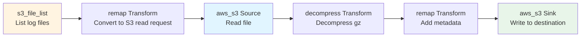
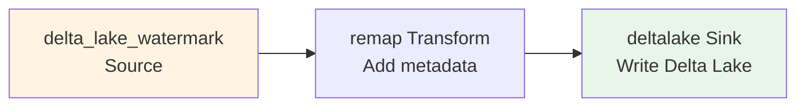
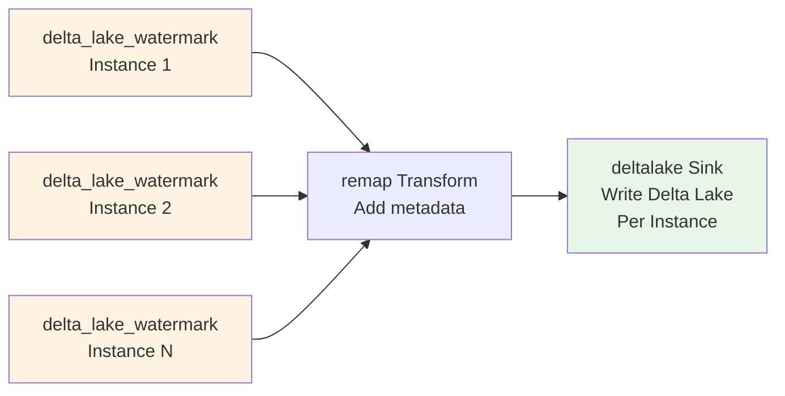
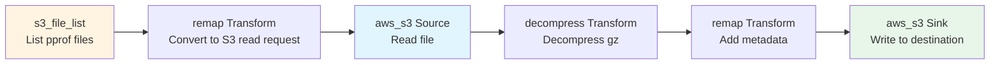

# Required Vector Plugins for Product Concept

## Overview

This document analyzes the required Vector plugins to implement the product concept described in `product_concept.md`. It identifies existing plugins, missing plugins, and implementation recommendations.

## Data Types and Requirements

### Supported Data Types

1. **raw_logs**: Raw application logs (gz compressed)
   - Path: `s3://bucket/diagnosis/data/{cluster_id}/merged-logs/{YYYYMMDDHH}/tidb/{instance}.log`
   - Format: Gzip compressed log files
   - Need: S3 file listing with time range filter, decompression, S3 write

2. **slowlog**: Slow query logs (Delta Lake format)
   - Path: `s3://bucket/deltalake/{org_id}/{cluster_id}/slowlogs/`
   - Format: Delta Lake table
   - Need: Delta Lake read (incremental), S3 write (Delta Lake format)

3. **sqlstatement**: SQL statement history (Delta Lake format)
   - Path: `s3://bucket/deltalake/{org_id}/{cluster_id}/sqlstatement/`
   - Format: Delta Lake table
   - Need: Delta Lake read (incremental), S3 write (Delta Lake format)

4. **topsql**: TopSQL performance data (Delta Lake format, per instance)
   - Path: `s3://bucket/deltalake/org={org_id}/cluster={cluster_id}/type=topsql_{component}/instance={instance}/`
   - Format: Delta Lake table (one per instance)
   - Need: Delta Lake read (incremental, per instance), S3 write (Delta Lake format)

5. **conprof**: Continuous profiling data (pprof gz files)
   - Path: `s3://bucket/{org_id}/{cluster_id}/{instance_id}/{cluster_id}/profiles/{timestamp}-{component}-{type}-{instance}.log.gz`
   - Format: Gzip compressed pprof files
   - Need: S3 file listing with time range filter, decompression, S3 write

## Existing Plugins Analysis

### ✅ Available Plugins

#### Sources

1. **`delta_lake_watermark`** (Custom, ✅ Implemented)
   - **Status**: ✅ Fully implemented
   - **Capabilities**: 
     - Incremental sync from Delta Lake tables
     - Checkpoint-based fault recovery
     - Time range filtering via `condition` parameter
     - Multi-cloud support (AWS, GCP, Azure, Aliyun)
   - **Use Cases**: 
     - ✅ slowlog (Delta Lake)
     - ✅ sqlstatement (Delta Lake)
     - ✅ topsql (Delta Lake, per instance)
   - **Location**: `src/sources/delta_lake_watermark/`

2. **`aws_s3`** (Vector Built-in, ✅ Available)
   - **Status**: ✅ Available in Vector
   - **Capabilities**:
     - Read files from S3
     - Supports compression detection
     - Can list and process files
   - **Limitations**:
     - ❌ No built-in time range filtering for file listing
     - ❌ No pattern-based file discovery (e.g., `{YYYYMMDDHH}/*.log`)
   - **Use Cases**: 
     - ⚠️ raw_logs (needs enhancement)
     - ⚠️ conprof (needs enhancement)

#### Sinks

1. **`aws_s3`** (Vector Built-in, ✅ Available)
   - **Status**: ✅ Available in Vector
   - **Capabilities**:
     - Write events to S3
     - Supports compression (gzip, etc.)
     - Supports batching
   - **Use Cases**: 
     - ✅ raw_logs (write compressed logs)
     - ✅ conprof (write pprof files)
     - ⚠️ Delta Lake data (needs custom sink)

2. **`deltalake`** (Custom, ✅ Implemented)
   - **Status**: ✅ Implemented
   - **Capabilities**:
     - Write data to Delta Lake format
     - Supports S3 as storage backend
   - **Use Cases**: 
     - ✅ slowlog (write to Delta Lake)
     - ✅ sqlstatement (write to Delta Lake)
     - ✅ topsql (write to Delta Lake)

#### Transforms

1. **`decompress`** (Vector Built-in, ✅ Available)
   - **Status**: ✅ Available in Vector
   - **Capabilities**:
     - Decompress gzip, zlib, snappy, lz4 files
   - **Use Cases**: 
     - ✅ raw_logs (decompress gz files)
     - ✅ conprof (decompress pprof gz files)

2. **`remap`** (Vector Built-in, ✅ Available)
   - **Status**: ✅ Available in Vector
   - **Capabilities**:
     - VRL-based data transformation
     - Field manipulation, filtering, enrichment
   - **Use Cases**: 
     - ✅ All data types (metadata enrichment)

## Missing Plugins

### 🔴 Critical Missing Plugins

#### 1. **`s3_file_list` Source** (High Priority)

**Purpose**: List and filter S3 files by time range and pattern

**Requirements**:
- List S3 objects matching a pattern (e.g., `diagnosis/data/{cluster_id}/merged-logs/{YYYYMMDDHH}/*.log`)
- Filter files by modification time (time range)
- Emit events for each file (with metadata: path, size, last_modified)
- Support pagination for large file lists
- Support prefix-based filtering

**Use Cases**:
- raw_logs: List log files in time range `{YYYYMMDDHH}/*.log`
- conprof: List pprof files in time range `profiles/{timestamp}-*.log.gz`

**Implementation Options**:

**Option A: Enhance `aws_s3` Source**
- Add time range filtering
- Add pattern-based file discovery
- Add file metadata emission

**Option B: Create Custom `s3_file_list` Source**
- New source specifically for file listing
- Lightweight, focused on listing only
- Emits file metadata events
- Can be chained with `aws_s3` source for actual file reading

**Recommended**: **Option B** - Create custom `s3_file_list` source

**Configuration Example**:
```toml
[sources.raw_logs_file_list]
type = "s3_file_list"
bucket = "o11y-prod-shared-us-east-1"
prefix = "diagnosis/data/10324983984131567830/merged-logs/"
pattern = "{YYYYMMDDHH}/tidb/*.log"
time_range_start = "2026-01-08T00:00:00Z"
time_range_end = "2026-01-08T23:59:59Z"
region = "us-east-1"

# Output: Events with file metadata
# {
#   "file_path": "diagnosis/data/.../merged-logs/2026010804/tidb/db-xxx-tidb-0.log",
#   "file_size": 1048576,
#   "last_modified": "2026-01-08T04:00:00Z",
#   "bucket": "o11y-prod-shared-us-east-1"
# }
```

**Architecture**:
```rust
pub struct S3FileListConfig {
    pub bucket: String,
    pub prefix: String,
    pub pattern: Option<String>,  // Pattern with {YYYYMMDDHH} placeholders
    pub time_range_start: Option<String>,
    pub time_range_end: Option<String>,
    pub region: Option<String>,
    pub max_keys: Option<usize>,
    pub poll_interval_secs: Option<u64>,
}
```

#### 2. **`s3_file_reader` Source** (Medium Priority)

**Purpose**: Read individual S3 files (complements `s3_file_list`)

**Requirements**:
- Read S3 file content
- Support decompression (gzip, etc.)
- Emit file content as events (one event per line for logs)
- Handle large files efficiently (streaming)

**Use Cases**:
- raw_logs: Read and decompress log files
- conprof: Read pprof files (may need special handling)

**Implementation Options**:

**Option A: Use Existing `aws_s3` Source**
- `aws_s3` source can read files
- But needs to be triggered by file list events
- May need transform to convert file list events to file read requests

**Option B: Create Custom `s3_file_reader` Source**
- Accepts file path from upstream (file list source)
- Reads and decompresses file
- Emits content events

**Recommended**: **Option A** - Use existing `aws_s3` source with transform

**Configuration Example**:
```toml
# File list source emits file paths
[sources.file_list]
type = "s3_file_list"
# ... config ...

# Transform: Convert file path to S3 read request
[transforms.file_to_s3_read]
type = "remap"
inputs = ["file_list"]
source = """
  .s3_bucket = .bucket
  .s3_key = .file_path
  .compression = "gzip"
"""

# S3 source reads the file
[sources.file_reader]
type = "aws_s3"
inputs = ["file_to_s3_read"]
bucket = "{{ s3_bucket }}"
key = "{{ s3_key }}"
compression = "{{ compression }}"
```

### 🟡 Enhancement Needed

#### 3. **Enhanced `deltalake` Sink for Cross-Account S3**

**Purpose**: Write Delta Lake data to user-provided S3 buckets (cross-account)

**Requirements**:
- Support cross-account S3 access via IAM Role
- Support custom S3 endpoints (for different regions)
- Support path-style vs virtual-hosted-style URLs
- Maintain Delta Lake transaction log integrity

**Current Status**: 
- ✅ `deltalake` sink exists
- ⚠️ May need enhancement for cross-account access

**Enhancement Needed**:
- Add IAM Role assumption support
- Add external_id support for security
- Test cross-account S3 access

**Configuration Example**:
```toml
[sinks.deltalake_destination]
type = "deltalake"
inputs = ["slowlog_source"]
endpoint = "s3://user-bucket/path/to/delta_table"
cloud_provider = "aws"
region = "us-west-2"
# New: Cross-account support
role_arn = "arn:aws:iam::USER_ACCOUNT:role/VectorSyncRole"
external_id = "unique-external-id"
```

### 🟢 Nice to Have

#### 4. **`pprof_parser` Transform** (Low Priority)

**Purpose**: Parse pprof files and extract metadata

**Requirements**:
- Parse pprof binary format
- Extract profile metadata (type, timestamp, component, instance)
- Optionally convert to structured format

**Use Cases**:
- conprof: Parse pprof files for metadata extraction

**Status**: 
- ⚠️ May not be necessary if pprof files are just copied as-is
- ✅ Can use existing file copy if no parsing needed

**Recommendation**: Skip for Phase 1, add later if needed

## Implementation Priority

### Phase 1.1: Critical Plugins (Must Have)

1. **`s3_file_list` Source** ⭐⭐⭐
   - **Priority**: Critical
   - **Effort**: Medium (2-3 weeks)
   - **Dependencies**: AWS SDK, S3 API
   - **Impact**: Enables raw_logs and conprof support

### Phase 1.2: Integration (High Priority)

2. **Enhanced `aws_s3` Source Integration** ⭐⭐
   - **Priority**: High
   - **Effort**: Low (1 week)
   - **Dependencies**: Existing `aws_s3` source, `s3_file_list` source
   - **Impact**: Completes raw_logs and conprof pipeline

3. **Cross-Account S3 Support for `deltalake` Sink** ⭐⭐
   - **Priority**: High
   - **Effort**: Medium (1-2 weeks)
   - **Dependencies**: AWS IAM, existing `deltalake` sink
   - **Impact**: Enables user-provided bucket option

### Phase 1.3: Polish (Medium Priority)

4. **Enhanced Error Handling** ⭐
   - **Priority**: Medium
   - **Effort**: Low (1 week)
   - **Impact**: Better user experience

5. **Progress Tracking for File-Based Sources** ⭐
   - **Priority**: Medium
   - **Effort**: Medium (1-2 weeks)
   - **Impact**: Better monitoring

## Plugin Architecture

### Data Flow for Each Data Type

#### raw_logs Flow



**Required Plugins**:
- ✅ `s3_file_list` source (NEW)
- ✅ `aws_s3` source (existing)
- ✅ `decompress` transform (existing)
- ✅ `remap` transform (existing)
- ✅ `aws_s3` sink (existing)

#### slowlog/sqlstatement Flow



**Required Plugins**:
- ✅ `delta_lake_watermark` source (existing)
- ✅ `remap` transform (existing)
- ✅ `deltalake` sink (existing, may need enhancement)

#### topsql Flow



**Required Plugins**:
- ✅ `delta_lake_watermark` source (existing, one per instance)
- ✅ `remap` transform (existing)
- ✅ `deltalake` sink (existing, may need enhancement)

#### conprof Flow



**Required Plugins**:
- ✅ `s3_file_list` source (NEW)
- ✅ `aws_s3` source (existing)
- ✅ `decompress` transform (existing)
- ✅ `remap` transform (existing)
- ✅ `aws_s3` sink (existing)

## Implementation Plan

### Step 1: Implement `s3_file_list` Source

**Location**: `src/sources/s3_file_list/`

**Files to Create**:
- `mod.rs` - Configuration and registration
- `source.rs` - Main source implementation
- `file_lister.rs` - S3 file listing logic
- `arch.md` - Architecture documentation

**Key Features**:
- List S3 objects with prefix and pattern matching
- Filter by modification time (time range)
- Emit file metadata events
- Support pagination
- Support time pattern parsing (e.g., `{YYYYMMDDHH}`)

**Configuration**:
```toml
[sources.s3_file_list]
type = "s3_file_list"
bucket = "my-bucket"
prefix = "path/to/files/"
pattern = "{YYYYMMDDHH}/*.log"  # Optional pattern
time_range_start = "2026-01-08T00:00:00Z"
time_range_end = "2026-01-08T23:59:59Z"
region = "us-east-1"
max_keys = 1000  # Optional pagination limit
poll_interval_secs = 60  # For continuous polling
```

### Step 2: Enhance Integration

**Tasks**:
1. Test `s3_file_list` → `aws_s3` source chain
2. Add transform to convert file list events to S3 read requests
3. Test end-to-end flow for raw_logs
4. Test end-to-end flow for conprof

### Step 3: Enhance `deltalake` Sink

**Tasks**:
1. Add IAM Role assumption support
2. Add external_id support
3. Test cross-account S3 access
4. Update documentation

## Summary

### Existing Plugins (✅ Ready to Use)

- ✅ `delta_lake_watermark` source - For Delta Lake data
- ✅ `aws_s3` source - For reading S3 files
- ✅ `aws_s3` sink - For writing to S3
- ✅ `deltalake` sink - For writing Delta Lake format
- ✅ `decompress` transform - For decompressing files
- ✅ `remap` transform - For data transformation

### New Plugins Required (🔴 Must Implement)

1. **`s3_file_list` Source** - List and filter S3 files by time range
   - **Priority**: Critical
   - **Effort**: Medium (2-3 weeks)
   - **Blocks**: raw_logs and conprof support

### Enhancements Needed (🟡 Should Implement)

2. **Cross-Account S3 Support for `deltalake` Sink**
   - **Priority**: High
   - **Effort**: Medium (1-2 weeks)
   - **Enables**: User-provided bucket option

### Total Implementation Effort

- **Critical Path**: 2-3 weeks (s3_file_list source)
- **Full Phase 1**: 4-5 weeks (including enhancements and testing)
- **Team Size**: 1-2 developers

### Risk Assessment

- **Low Risk**: Delta Lake data types (slowlog, sqlstatement, topsql) - all plugins exist
- **Medium Risk**: raw_logs and conprof - need new `s3_file_list` source
- **Mitigation**: Start with `s3_file_list` source implementation early, test with small datasets first
